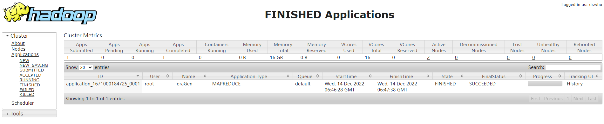

# hadoop集群容器化

## 1、hadoop集群容器网络规划

> master: 172.17.0.2
> slave1: 172.17.0.3
> slave2: 172.17.0.4

## 2、hadoop集群镜像构建

> 已经存在centos-base集成镜像的前提下进行构建cluster-hadoop镜像
> docker build -t  cluster-hadoop ./

## 3、hadoop docker方式启动集群(二选一)

```bash
docker network create --subnet=172.18.0.0/16 hadoop-network
docker run -itd --name hadoop-master --hostname=master --net hadoop-network --ip 172.18.0.2 cluster-hadoop
docker run -itd --name hadoop-slave1 --hostname=slave1 --net hadoop-network --ip 172.18.0.3 cluster-hadoop
docker run -itd --name hadoop-slave2 --hostname=slave2 --net hadoop-network --ip 172.18.0.4 cluster-hadoop
```

## 4、hadoop docker-compose方式启动集群(二选一)

```bash
docker-compose up -d
```

## 5、进入到master节点进行hdfs格式化并启动集群

```bash
docker exec -it hadoop-master /bin/bash
hdfs namenode -format
/usr/local/hadoop/sbin/start-all.sh
```

## 6、跑terasort测试程序生成测试数据

```bash
hadoop jar /usr/local/hadoop/share/hadoop/mapreduce/hadoop-mapreduce-examples-2.6.0.jar teragen -Dmapred.map.tasks=5 3000 /output
```

### 6.1、结果




